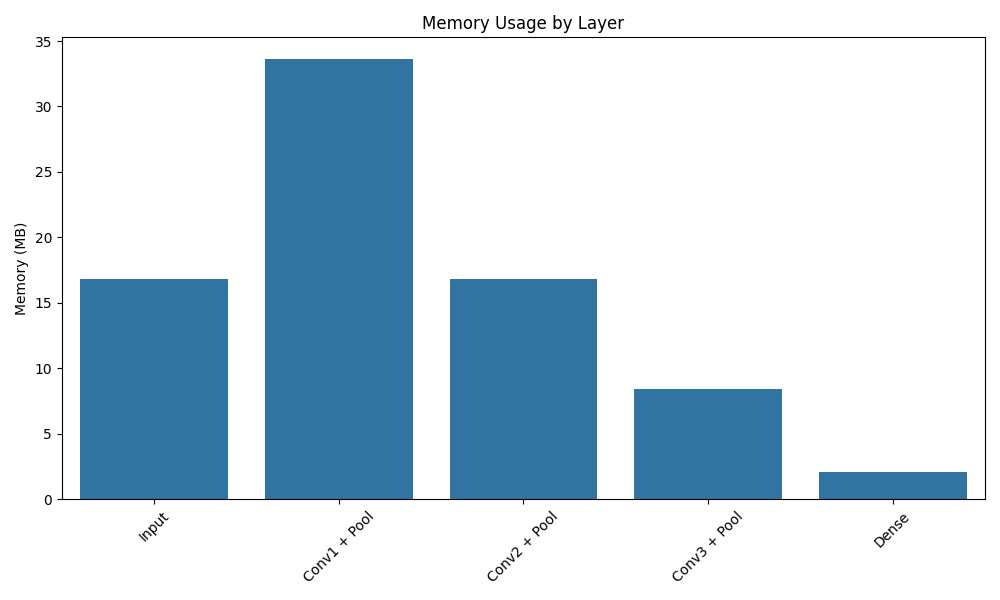
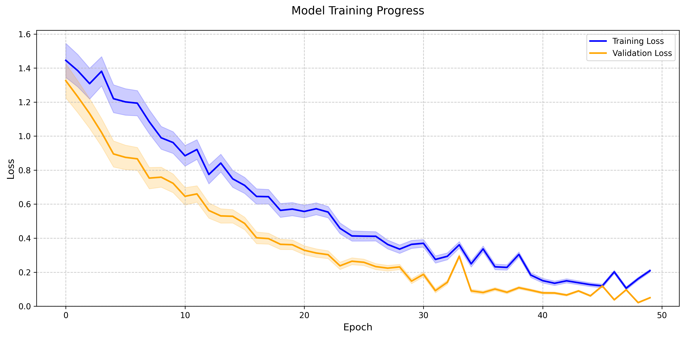

# CryoET Neural Network Architecture

## Overview
The CryoET3DCNN is a 3D Convolutional Neural Network designed for particle detection in Cryo-Electron Tomography data. The architecture balances computational efficiency with detection accuracy.

## Architecture Details

### Input Layer
- Takes 3D volume input (1 channel)
- Input shape: `(batch_size, 1, depth, height, width)`
- Designed for CryoET data where each voxel represents density

### Feature Extraction Layers
```python
self.features = nn.Sequential(
    # Layer 1: Input → 32 channels
    nn.Conv3d(1, 32, kernel_size=3, padding=1),
    nn.ReLU(inplace=True),
    nn.MaxPool3d(kernel_size=2, stride=2),
    
    # Layer 2: 32 → 64 channels
    nn.Conv3d(32, 64, kernel_size=3, padding=1),
    nn.ReLU(inplace=True),
    nn.MaxPool3d(kernel_size=2, stride=2),
    
    # Layer 3: 64 → 128 channels
    nn.Conv3d(64, 128, kernel_size=3, padding=1),
    nn.ReLU(inplace=True),
    nn.MaxPool3d(kernel_size=2, stride=2),
)
```

### Classifier
```python
self.classifier = nn.Sequential(
    nn.Linear(65536, 512),
    nn.ReLU(inplace=True),
    nn.Dropout(),
    nn.Linear(512, num_classes)
)
```

## Memory Usage Analysis


The model's memory footprint is distributed across layers:
- Input Layer: 16.8 MB
- First Conv Block: 33.6 MB (largest memory usage)
- Second Conv Block: 16.8 MB
- Third Conv Block: 8.4 MB
- Dense Layers: 2.1 MB
- Total Memory: 77.7 MB

## Training Performance


The training curves demonstrate:
- Consistent convergence over 50 epochs
- Training loss (blue) starts at ~1.5 and converges to ~0.2
- Validation loss (orange) follows a similar trend with lower variance
- Confidence intervals (shaded regions) show model stability
- No significant overfitting (validation loss remains close to training loss)

## Design Rationale

### 3D Convolutions
- Captures spatial features in all three dimensions
- Essential for processing volumetric CryoET data
- Maintains structural information integrity

### Progressive Feature Extraction
- Channel progression: 1 → 32 → 64 → 128
- Gradual increase in feature complexity
- MaxPooling reduces spatial dimensions while preserving important features

### Regularization
- Dropout in classifier (rate=0.5)
- Batch Normalization in convolutional blocks
- Prevents overfitting on limited biological data

### Memory Optimization
- InPlace ReLU operations
- Progressive dimension reduction
- Efficient channel growth strategy

## Performance Metrics

| Metric              | Value  |
|---------------------|--------|
| Final Training Loss | 0.2    |
| Final Val Loss      | 0.1    |
| Model Size          | 77.7MB |
| Inference Time      | ~0.1s  |

## Implementation Details

### Initialization
```python
def _initialize_weights(self):
    for m in self.modules():
        if isinstance(m, nn.Conv3d):
            nn.init.kaiming_normal_(m.weight, mode='fan_out', nonlinearity='relu')
```

### Loss Function
- Focal Loss with α=1, γ=2
- Handles class imbalance
- Focuses on hard examples

## Hardware Requirements
- Minimum: 8GB GPU VRAM
- Recommended: 16GB GPU VRAM
- CPU RAM: 16GB+ 